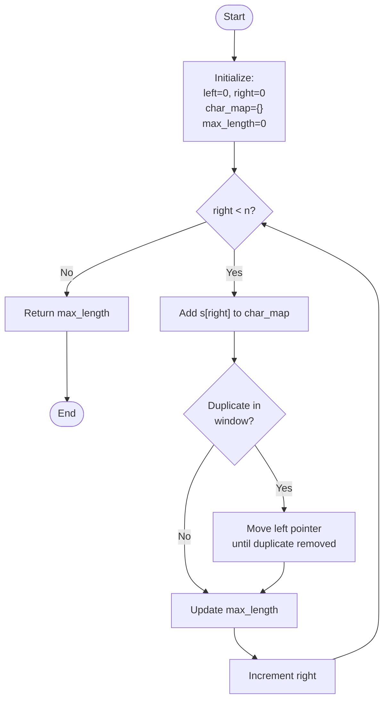

# Proper Documentation Template for LeetCode Solutions

> **File Name**: `solve.readme` (to be created in each problem folder)

---

## 1. **Problem Statement** (Revision)

Clearly state the problem with:

- Input constraints
- Output requirements
- Examples (at least 2-3)
- Edge cases mentioned in problem

**Example:**

```
You are given a string `s` consisting only of characters `'a'` and `'b'`.
- Constraints: 1 <= s.length <= 10^5
- Task: Find the longest substring without repeating characters
```

---

## 2. **Key Intuition**

Explain the core idea behind the solution in 2-3 sentences:

- What observation leads to the solution?
- Why does this approach work?
- Any patterns or properties we exploit?

**Example:**

```
The key insight is that we can use a sliding window with a hashmap to track 
characters in the current window. When we encounter a duplicate, we shrink the 
window from the left until the duplicate is removed.
```

---

## 3. **Pattern Recognition & Practice Problems**

### Core Pattern Identified

**Pattern Name:** [e.g., Sliding Window, Two Pointers, Greedy, Dynamic Programming]

**Pattern Characteristics:**

- When to use this pattern? (What problem properties trigger this?)
- Key identifying features in problem statement
- Common variations of this pattern

**Example:**

```
This is a SLIDING WINDOW pattern because:
1. We need to find a substring/subarray
2. We need an optimal/maximum/minimum value
3. The result depends on a contiguous portion of input
4. We can use two pointers to track window boundaries
```

### Practice Problems for This Pattern

**Easy:**

- LeetCode 121: Best Time to Buy and Sell Stock
- LeetCode 283: Move Zeroes

**Medium:**

- LeetCode 3: Longest Substring Without Repeating Characters (This Problem)
- LeetCode 209: Minimum Size Subarray Sum
- LeetCode 438: Find All Anagrams in a String
- LeetCode 567: Permutation in String
- LeetCode 424: Longest Repeating Character Replacement

**Hard:**

- LeetCode 76: Minimum Window Substring
- LeetCode 327: Count of Range Sum

### Why Practice These?

[Explain how these problems strengthen understanding of this pattern and prepare for variations]

**Example:**

```
These problems reinforce sliding window by:
1. Showing different ways to track window state (sets, maps, counters)
2. Demonstrating window shrinking strategies
3. Handling various constraint types (length, sum, frequency, etc.)
4. Building pattern recognition for similar interview questions
```

---

## 4. **Flow Diagram / Algorithm Visualization**

### Algorithm Flow (Mermaid Diagram)



### State Transition Diagram

Use this to understand how the algorithm transitions through different states:

| State | Condition | Action | Next State |
|-------|-----------|--------|-----------|
| EXPAND | No duplicate | Add char, increment right | EXPAND/CHECK |
| CHECK | Duplicate found | Update max_length | SHRINK |
| SHRINK | Duplicate exists | Move left pointer | CHECK |
| DONE | right == n | Return result | END |

### Visual Example

```
Input: s = "abcabcbb"
       Index: 0 1 2 3 4 5 6 7

Step 1: Window [a]           → max_length = 1
Step 2: Window [ab]          → max_length = 2
Step 3: Window [abc]         → max_length = 3
Step 4: Duplicate 'a' found, shrink → [bca...]
Step 5: Continue expanding and shrinking...
Final: max_length = 3
```

**When to Use Diagrams:**

- Complex multi-step algorithms
- State machines or recursive calls
- Dependency chains or graph traversals
- Tree/Graph structures
- Decision trees for conditionals

---

## 5. **Approaches** (Multiple if applicable)

### Approach 1: [Name - e.g., Sliding Window + HashMap]

**Description:**

- Step-by-step explanation of the algorithm
- Data structures used
- Why this approach works

**Pseudocode:**

```
1. Initialize: left = 0, char_map = {}, max_length = 0
2. Iterate right pointer from 0 to n-1:
   - Add current character to char_map
   - If duplicate found, move left pointer until duplicate removed
   - Update max_length
3. Return max_length
```

**Code Reference:** See implementation in corresponding `.cpp` file

---

### Approach 2: [Alternative approach if exists]

[Follow same format as Approach 1]

---

## 6. **Dry Run / Walkthrough**

Use a concrete example to trace through the algorithm:

**Input:** `s = "abcabcbb"`

| Step | left | right | char | char_map | Window | max_length |
|------|------|-------|------|----------|--------|------------|
| 0    | 0    | 0     | 'a'  | {a:0}    | "a"    | 1          |
| 1    | 0    | 1     | 'b'  | {a:0,b:1}| "ab"   | 2          |
| 2    | 0    | 2     | 'c'  | {a:0,b:1,c:2} | "abc" | 3 |
| 3    | 0    | 3     | 'a'  | duplicate! Move left | - | - |
| ...  | ...  | ...   | ...  | ...      | ...    | ...        |

---

## 7. **Complexity Analysis**

| Approach | Time Complexity | Space Complexity | Notes |
|----------|-----------------|------------------|-------|
| Approach 1: Sliding Window | O(n) | O(min(m, n)) | m = charset size, n = string length |
| Approach 2: [Name] | O(...) | O(...) | Explanation |
| Brute Force (if applicable) | O(n²) | O(1) | Not recommended due to high time |

**Detailed Explanation:**

- **Time:** Each character is visited at most twice (once by right pointer, once by left pointer)
- **Space:** HashMap stores at most unique characters in the current window

---

## 8. **Tricks & Edge Cases** (Important for Future Revision)

### Edge Cases to Consider

- Empty string: Handle or return 0?
- Single character: Should return 1
- All same characters: Should return 1
- All unique characters: Should return length of string
- Long string with specific patterns: Test boundary conditions

### Tricks & Optimizations

1. **HashMap vs Array:** Use array if charset is small (a-z) for O(1) space improvement
2. **Two-pointer pattern:** Critical for sliding window problems
3. **Character indexing:** Store the last index of character instead of just presence for cleaner code
4. **Early termination:** If remaining string length < current max, we can break early

### Common Mistakes

- Forgetting to update max_length after each valid window
- Not properly handling the left pointer movement
- Using wrong data structure (e.g., set instead of hashmap with indices)

---

## 9. **Problem Tags & Related Problems**

**Tags:** String, Sliding Window, HashMap/Set

**Similar Problems:**

- LeetCode 159: Longest Substring with At Most Two Distinct Characters
- LeetCode 567: Permutation in String
- LeetCode 76: Minimum Window Substring

---

## 10. **Implementation Files**

- **Solution File:** `[problem-number]-[problem-name].cpp`
- **Preferred Approach:** [Mention best approach used in code]
- **Language:** C++17 or newer
- **Coding Style:** Follow standard conventions (meaningful variable names, comments for complex logic)

---

## 11. **Revision Checklist** (For Future Study)

- [ ] Understand the problem completely
- [ ] Identify the pattern/technique needed (sliding window, BFS, DP, etc.)
- [ ] Explain the intuition without looking at code
- [ ] Trace through the algorithm on paper with example
- [ ] Code from scratch without referring to solution
- [ ] Test all edge cases mentioned above
- [ ] Optimize if needed (time/space)
- [ ] Compare with other approaches

---

## 12. **Notes for Future Reference**

[Add any additional observations, optimizations discovered later, or alternative techniques]

Example:

```
- Discovered that using array instead of HashMap improves performance for small charset
- Interview tip: Explain sliding window pattern first before coding
- Related pattern: Longest Substring with K Distinct Characters extends this problem
```
